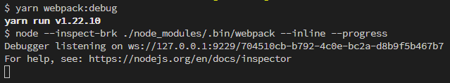
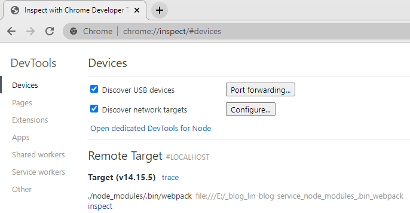
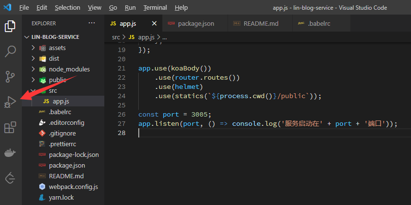
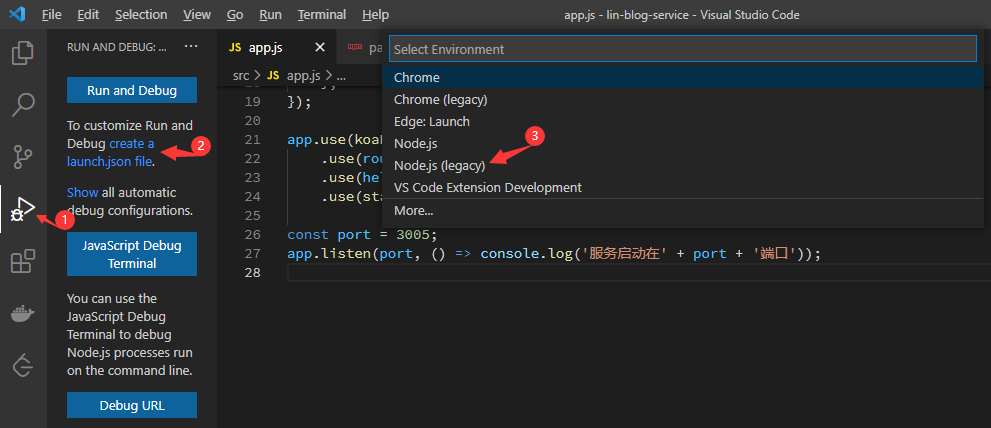

- webpack
- webpack-cli
- clean-webpack-plugin 
- webpack-node-externals 
- @babel/core 
- @babel/node 
- @babel/presets-env 
- babel-loader 
- cross-env

> 运行`yarn webpack:debug`或者`npm run webpack:debug`后终端就会 输出如下所示：
>
> 

然后在chrome浏览器中输入`chrome://inspect`回车

在vscode中调试

第一步：

- 点击下图箭头所指的图标

- 添加调试配置

选择之后程序就会在项目的根目录创建`.vscode/launch.json`文件

- 第二步

添加`nodemon`调试程序的配置

